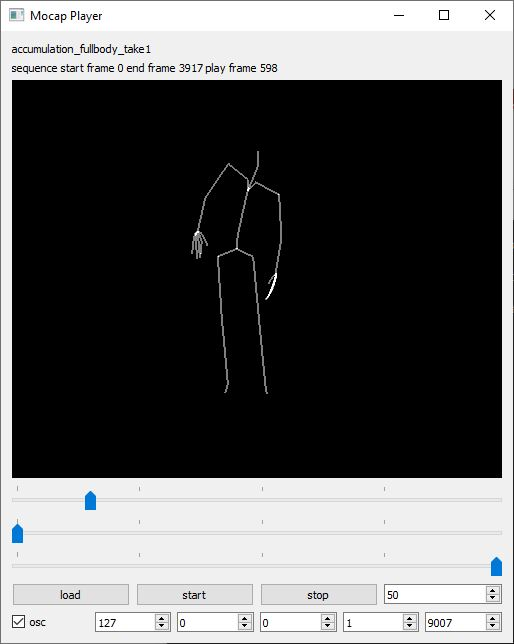

## MocapPlayer

### Summary

The MocapPlayer is a simple Python-based software for playing motion capture data that has been recorded either in [BVH](https://en.wikipedia.org/wiki/Biovision_Hierarchy#:~:text=BioVision%20Hierarchy%20(BVH)%20is%20a,acquired%20by%20Motion%20Analysis%20Corporation.) or [FBX](https://en.wikipedia.org/wiki/FBX#:~:text=FBX%20(from%20Filmbox)%20is%20a,series%20of%20video%20game%20middleware.) format. While playing, it sends skeleton joint data in the form of local and global positions and local and global rotations via [OSC](https://en.wikipedia.org/wiki/Open_Sound_Control) to any destination address. The player can also be remote controlled via OSC.

### Features

The player reads motion capture recordings that have been saved in BVH and (with limitations) in FBX format. 
While playing, a simple stick figure representation of the captured recording is displayed. This view can be translated, scaled, and rotated using the middle mouse button, mouse scroll wheel, and right mouse button, respectively. 
Start and end frames for playback and playback speed can be flexibly chosen and playback automatically loops. 
The IP address and port to which the player sends joint data as OSC messages can also be changed.
The player offers a simple GUI to manipulate these features.

### Limitations

The player only supports motion capture recordings that contain a single person.
It reads only motion capture recordings in FBX format in which each skeleton pose has its own keyframe and in which the number of keyframes is the same for all skeleton joints.
The GUI doesn't support the loading of motion capture recordings. Recordings have to be changed either via OSC or by modifying the player code.
The GUI also doesn't support changing the port through which the player receives OSC messages.

### OSC Communication

The player sends the following OSC messages representing the joint positions and rotations of the currently displayed motion capture skeleton.
Each message contains all the joint properties grouped together as follows: j1_p1 j1_p2 ... j1_pD, j2_p1, j2_p2, ... j2_pD, ... , jN_p1, jN_p2, ... jN_pD- Here, j stands for joint, p for parameter, N for number of joints, and D for dimension of parameters.

The following OSC messages are sent by the MocapPlayer:

- joint positions as list of 3D vectors relative to parent joint: `/mocap/0/joint/pos_local <float j1x> <float j1y> <float j1z> .... <float jNx> <float jNy> <float jNz>` 
- joint positions as list of 3D vectors in world coordinates: `/mocap/0/joint/pos_world <float j1x> <float j1y> <float j1z> .... <float jNx> <float jNy> <float jNz>` 
- joint rotations as list of Quaternions relative to parent joint: `/mocap/0/joint/rot_local <float j1w> <float j1x> <float j1y> <float j1z> .... <float jNw> <float jNx> <float jNy> <float jNz>` 
- joint rotations as list of Quaternions in world coordinates: `/mocap/0/joint/rot_local <float j1w> <float j1x> <float j1y> <float j1z> .... <float jNw> <float jNx> <float jNy> <float jNz>` 

The following OSC messages are received by the MocapPlayer:

- load a motion capture file: `/player/load <string filename>`
- start playback of motion capture file: `/player/start`
- stop playback of motion capture file: `/player/stop`
- set playback speed in fps (frames per second) of motion capture file: `/player/fps <int fps>`
- set playback position to specific frame: `/player/frame <int frame>`
- set start frame of playback range : `/player/start_frame <int frame>`
- set end frame of playback range : `/player/end_frame <int frame>`

