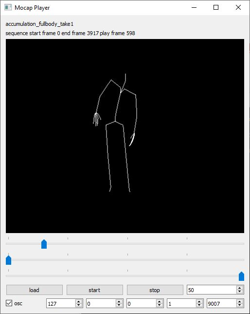

## AI-Toolbox - Motion Utilities - Mocap Player



### Summary

The MocapPlayer is a simple Python-based software for playing motion capture data that has been recorded either in [BVH](https://en.wikipedia.org/wiki/Biovision_Hierarchy#:~:text=BioVision%20Hierarchy%20(BVH)%20is%20a,acquired%20by%20Motion%20Analysis%20Corporation.) or [FBX](https://en.wikipedia.org/wiki/FBX#:~:text=FBX%20(from%20Filmbox)%20is%20a,series%20of%20video%20game%20middleware.) format. While playing, it sends skeleton joint data in the form of local and global positions and local and global rotations via [OSC](https://en.wikipedia.org/wiki/Open_Sound_Control) to any destination address. The software can also be remote controlled via OSC.

### Installation

The software runs within the Premiere anaconda environment. Instructions how to setup this environment are available as part of the [installation documentation ](https://github.com/bisnad/AIToolbox/tree/main/Installers) in the [AI Toolbox github repository](https://github.com/bisnad/AIToolbox). 

### Directory Structure

- MocapPlayer (contains software specific python scripts)
  - common (contains python scripts for handling mocap data)
  - controls (contains MaxMSP patch to remote control the software)
  - data 
    - media (contains media used in this Readme)
    - mocap (contains an example mocap recording)

### Usage

#### Start

The software can be started either by double clicking the mocap_player.bat (Windows) or mocap_player.sh (MacOS) shell scripts or by typing the following commands into the Anaconda terminal:

```
conda activate premiere
cd MocapPlayer
python mocap_player.py
```

#### Default Mocap File

When the software starts, it automatically reads the example motion capture file contained within the MocapPlayer/data/mocap folder. An alternative mocap file can be read either when the software starts or while it is running. In the latter case, the software can only read mocap files that contain the same skeleton topology as the mocap file that was read during startup. To read a different mocap file during software startup, the following source code in the file mocap_player.py has to be modified:

```
motion_player.config = { 
    "file_name": "data/mocap/Muriel_Take1.fbx",
    "fps": 50
    }
```

In this code, `file_name` represents the path to the mocap file and fps represents the `frames per seconds` of the recording. 

#### Functionality

The software can play motion capture recordings of a single performer that have been saved in FBX or BVH format. Playback loops between a user specified start and end frame. While a recording is played, the recorded performer is graphically depicted as a simple stick figure. Also, while the software plays, it sends for each frame the joint information of the performer as OSC data. This information includes the joint position and rotation both in local and global coordinates. In global coordinates, joint positions and rotations are relative to an absolute reference position and rotation in space.  In local coordinates, joint positions and rotations are relative to the positions and rotations of the parent joints.  Before closing the software, playback has to be stopped.

#### Graphical User Interface

The graphical user interface of the software provides the following functionality or conveys the following information (from top to bottom and left to right):

- The text at the top of the window displays the name of the currently loaded mocap file.
- The text underneath shows the start and end frame of the playback range and the currently played frame. 
- The large graphical window displays a simple stick figure that shows the skeleton pose of the currently played mocap frame. The rotation, position, and scale of the stick figure can be changed with the mouse. Dragging with the left mouse button pressed rotates the figure. Dragging with the middle mouse button pressed moves the figure. Operating the scroll wheel zooms the figure in and out. 
- The frame slider underneath the graphical window shows the play head which moves as the currently played frame increments. The currently played frame can also be moved manually by dragging the play head with the left mouse button.
- The start frame slider allows to change the start frame of the playback range.
- The end frame slider allows to change the end frame of the playback range. 
- The load button opens a file selector to load a different motion capture file.
- The start button begins playback of the mocap recording.
- The stop button ends playback of the mocap recording.
- The fps number box allows to change the frames per seconds with which the mocap recording is played.
- The osc toggle turns OSC sending on and off.
- The four IP address number boxes allow to change the destination address to which OSC data is sent to.
- The port number box allows to change the destination port to which OSC data is sent to. 

### OSC Communication

The software sends the following OSC messages representing the joint positions and rotations of the currently displayed motion capture figure.
Each message contains all the joint properties grouped together as follows: j1_p1 j1_p2 ... j1_pD, j2_p1, j2_p2, ... j2_pD, ... , jN_p1, jN_p2, ... jN_pD- Here, j stands for joint, p for parameter, N for number of joints, and D for dimension of parameters.

The following OSC messages are sent by the software:

- joint positions as list of 3D vectors relative to parent joint: `/mocap/0/joint/pos_local <float j1x> <float j1y> <float j1z> .... <float jNx> <float jNy> <float jNz>` 
- joint positions as list of 3D vectors in world coordinates: `/mocap/0/joint/pos_world <float j1x> <float j1y> <float j1z> .... <float jNx> <float jNy> <float jNz>` 
- joint rotations as list of Quaternions relative to parent joint: `/mocap/0/joint/rot_local <float j1w> <float j1x> <float j1y> <float j1z> .... <float jNw> <float jNx> <float jNy> <float jNz>` 
- joint rotations as list of Quaternions in world coordinates: `/mocap/0/joint/rot_local <float j1w> <float j1x> <float j1y> <float j1z> .... <float jNw> <float jNx> <float jNy> <float jNz>` 

The software can be remote controlled by sending OSC messages to it. A example Max/MSP patch demonstrates the use of this remote control functionality. The following OSC messages can be used to remote control the software.

- load a motion capture file: `/player/load <string filename>`
- start playback of motion capture file: `/player/start`
- stop playback of motion capture file: `/player/stop`
- set playback speed in fps (frames per second) of motion capture file: `/player/fps <int fps>`
- set playback position to specific frame: `/player/frame <int frame>`
- set start frame of playback range : `/player/start_frame <int frame>`
- set end frame of playback range : `/player/end_frame <int frame>`

### Limitations and Bugs

- The player only supports motion capture recordings that contain a single person.

- It reads only motion capture recordings in FBX format in which each skeleton pose has its own keyframe and in which the number of keyframes is the same for all skeleton joints.
- The software hangs if it is closed whole playing a motion capture recording. Stopping the playback beforehand prevents this from happening.


