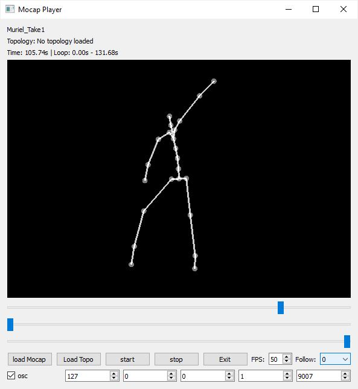

## AI-Toolbox - Motion Utilities - Mocap Player



Figure 1: The figure shows a screenshot of the MocapPlayer software.

### Summary

The MocapPlayer is a Python-based software for playing motion capture data that has been recorded either in [BVH](https://en.wikipedia.org/wiki/Biovision_Hierarchy#:~:text=BioVision%20Hierarchy%20(BVH)%20is%20a,acquired%20by%20Motion%20Analysis%20Corporation.), [FBX](https://en.wikipedia.org/wiki/FBX#:~:text=FBX%20(from%20Filmbox)%20is%20a,series%20of%20video%20game%20middleware.), or NPZ format. While playing, the software sends skeleton joint data in the form of local and global positions and local and global rotations via [OSC](https://en.wikipedia.org/wiki/Open_Sound_Control) to any destination address. The software can also be remote controlled via OSC.

### Installation

The software runs within the *premiere* anaconda environment. For this reason, this environment has to be setup beforehand.  Instructions how to setup the *premiere* environment are available as part of the [installation documentation ](https://github.com/bisnad/AIToolbox/tree/main/Installers) in the [AI Toolbox github repository](https://github.com/bisnad/AIToolbox). 

The software can be downloaded by cloning the [MotionUtilities Github repository](https://github.com/bisnad/MotionUtilities). After cloning, the software is located in the MotionUtilities / MocapPlayer directory.

### Directory Structure

- MocapPlayer (contains software specific python scripts)
  - common (contains python scripts for handling mocap data)
  - controls (contains a MaxMSP patch to remote control the software)
  - data 
    - media (contains media used in this Readme)
    - configs (contains skeleton configuration files required for mocap files in NPZ format)
    - mocap (contains an example mocap recording)

### Usage

#### Start

The software can be started either by double clicking the mocap_player.bat (Windows) or mocap_player.sh (MacOS) shell scripts or by typing the following commands into the Anaconda terminal:

```
conda activate premiere
cd MocapPlayer
python mocap_player.py
```

#### Default Mocap File

When the software starts, it automatically reads an example motion capture file that is located in the MocapPlayer/data/mocap folder. An alternative mocap file can be read either when the software starts or while it is running. To read a different mocap file during software startup, the following source code in the file mocap_player.py has to be modified:

```
motion_player.config["file_name"] = "data/mocap/Muriel_Take1.fbx"
motion_player.config["topology_file_name"] = ""
motion_player.config["fps"] = 50
```

In this code, the string assigned to motion_player.config["file_name"] specifies the path to a motion-capture file. 

If the mocap file is in NPZ format, the string assigned to motion_player.config["topology_file_name"] specifies the path to a skeleton configuration file. Example configuration files are located in the data/configs folder. If the mocap file is in FBX or BVH format, the skeleton topology is read directly from the mocap file and no skeleton configuration file needs to be provided.

The integer value assigned to motion_player.config["fps"] specifies the playback frame rate.

#### Functionality

The software can play motion-capture recordings of single or multiple performers saved in [FBX](https://en.wikipedia.org/wiki/FBX#:~:text=FBX%20(from%20Filmbox)%20is%20a,series%20of%20video%20game%20middleware.), [BVH](https://en.wikipedia.org/wiki/Biovision_Hierarchy#:~:text=BioVision%20Hierarchy%20(BVH)%20is%20a,acquired%20by%20Motion%20Analysis%20Corporation.) or NPZ format. Playback loops between user-specified start and end frames. During playback, the recorded performer(s) are displayed graphically as simple stick figures. The software also sends each frame’s joint information as OSC data. This information includes joint positions and rotations in both global and local coordinates. In global coordinates, joint positions and rotations are relative to an absolute reference position and orientation in space. In local coordinates, joint positions and rotations are relative to the positions and rotations of their parent joints. 

#### Graphical User Interface

The graphical user interface of the software provides the following functionality or conveys the following information (from top to bottom and left to right):

- A text to display the currently loaded mocap file.
- A text to display the currently loaded skeleton configuration file.
- A text to display the current play time and the start end time of the playback range in seconds.
- A graphical window to display the pose corresponding to the current motion capture frame as a simple stick figure. The rotation, position, and scale of the stick figure can be changed with the mouse. Dragging with the left mouse button rotates the figure. Dragging with the middle mouse button moves the figure. Operating the scroll wheel zooms the figure in and out. 
- A slider to display and change the current play time.  
- A slider to set the start time of the playback range.
- A slider to set the end time of the playback range.
- Five buttons to load a mocap file, load a skeleton configuration file, start playback, stop playback, and exit the application. 
- A number box to change the frames per seconds with which the mocap recording is played.
- A pulldown menu to center the camera view to the root joint of the skeleton.
- A toggle to turn OSC sending on and off.
- Four number boxes to change the IP address to which OSC data is sent to.
- A number box to change the port number box to which OSC data is sent to. 

### OSC Communication

The software sends the following OSC messages representing the joint positions and rotations of the currently displayed motion capture skeletons. The  address of the OSC messages indicates which skeleton the joint data correspond two. For the first skeleton, the address starts with /mocap/0, for the second it starts with /mocap/1, and so on.
Each message contains all the joint positions and rotations grouped together. In the OSC messages described below, I represents the skeleton index and N represents the number of joints.

The following OSC messages are sent by the software:

- joint positions as list of 3D vectors relative to parent joint: `/mocap/I/joint/pos_local <float j1x> <float j1y> <float j1z> .... <float jNx> <float jNy> <float jNz>` 
- joint positions as list of 3D vectors in world coordinates: `/mocap/I/joint/pos_world <float j1x> <float j1y> <float j1z> .... <float jNx> <float jNy> <float jNz>` 
- joint rotations as list of Quaternions relative to parent joint: `/mocap/I/joint/rot_local <float j1w> <float j1x> <float j1y> <float j1z> .... <float jNw> <float jNx> <float jNy> <float jNz>` 
- joint rotations as list of Quaternions in world coordinates: `/mocap/I/joint/rot_world <float j1w> <float j1x> <float j1y> <float j1z> .... <float jNw> <float jNx> <float jNy> <float jNz>` 

The software can be remote controlled by sending OSC messages to it. By default, the software receives OSC messages on port 9002. To change this port, the following source code in the file mocap_player.py has to be modified:

```
motion_control.config["port"] = 9002
```

In this code, the number 9002 needs to be replaced to specify a different port.

An example Max patch demonstrates the use of the remote control functionality. The following OSC messages can be used to remote control the software. 

- load a motion capture file: `/player/load <string filename>`
- start playback: `/player/start`
- stop playback: `/player/stop`
- set playback speed in fps (frames per second): `/player/fps <int fps>`
- set playback position to specific frame: `/player/frame <int frame>`
- set start frame of playback loop: `/player/start_frame <int frame>`
- set end frame of playback loop: `/player/end_frame <int frame>`

### Limitations and Bugs

- There are currently no reported bugs.


