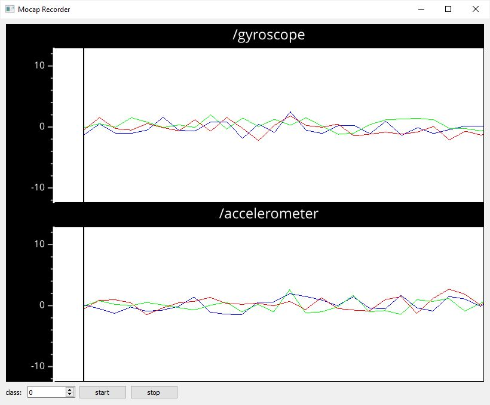

## MocapRecorder

### Summary

The MocapRecorder is a simple Python-based software for recording sensor data streams that it receives via [OSC](https://en.wikipedia.org/wiki/Open_Sound_Control). The sensor values can be optionally visualised as time-series plots. Each recording can be associated with a class label if it is intended to be used to subsequently train a MocapClassifier.  The class labels and sensor values are stored as Python dictionaries. 

### Features

The recorder is mainly meant to receive and store sensor data streams that it receives via OSC. 
The recording functionality works for any type of OSC message even if it doesn't contain sensor data.
The receives sensor values can be optionally visualised as time-series plots.
The recorded sensor values can be associated with class labels that are stored alongside.
Sensor data and class labels are stored as pickled Python dictionaries. 
The recorder a simple GUI to start and stop recordings and assign class labels.

### Limitations

The OSC messages whose values the recorder visualises and the network port the recorder listens to must be set in the source code and can not be modified through a GUI.
The visualisation of the sensor values as timeseries is very slow. 

### OSC Communication

The MocapRecorder records and stores any OSC messages it receives.

