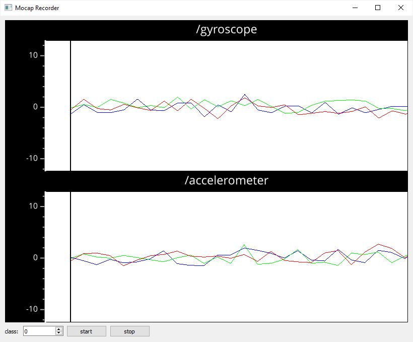

## AI-Toolbox - Motion Utilities - Mocap Recorder



Figure 1: The figure shows a screenshot of the MocapRecorder software that is receiving gyroscope and acceleration data from an IMU sensor.

### Summary

The MocapRecorder is a simple Python-based software for recording sensor data streams that it receives motion data via [OSC](https://en.wikipedia.org/wiki/Open_Sound_Control). Motion data can come from any source such as a full body motion capture system or individual wearable sensors. The motion data can be optionally visualised as time-series plots. Each recording can be associated with a class label if it is to be used to train a motion classifier such as the [MocapClassifier](https://github.com/bisnad/MotionAnalysis/tree/main/MocapClassifier) included among the [MotionAnalysis](https://github.com/bisnad/MotionAnalysis) tools of the [AI-Toolbox](https://github.com/bisnad/AIToolbox).  The class labels and sensor values are stored as Python dictionaries. 

### Installation

The software runs within the *premiere* anaconda environment. For this reason, this environment has to be setup beforehand.  Instructions how to setup the *premiere* environment are available as part of the [installation documentation ](https://github.com/bisnad/AIToolbox/tree/main/Installers) in the [AI Toolbox github repository](https://github.com/bisnad/AIToolbox). 

The software can be downloaded by cloning the [MotionUtilities Github repository](https://github.com/bisnad/MotionUtilities). After cloning, the software is located in the MotionUtilities / MocapRecorder directory.

### Directory Structure

- MocapRecorder (contains software specific python scripts)
  - data 
    - media (contains media used in this Readme)
  - recordings (location where recordings are stored)

### Usage

#### Start

The software can be started either by double clicking the mocap_recorder.bat (Windows) or mocap_recorder.sh (MacOS) shell scripts or by typing the following commands into the Anaconda terminal:

```
conda activate premiere
cd MocapRecorder
python mocap_recorder.py
```

#### Functionality

The software can receive and store any sensor values that it receives via OSC. Each OSC messages is stored together with a timestamp that represents the time when the message was received. The recorded sensor values can be associated with class labels that are stored as well. Optionally, the received sensor values can be visualised as time-series plots. Since the visualisation computationally demanding, it should only be used to verify that sensor data is incoming but otherwise be turned off during a recording. The recorded sensor values, time stamps, and class labels are stored within the recordings folder as Python dictionaries. The file names for the recordings are generated automatically and have the following format: Mocap_class Mocap_class_<class_id>_time_<time_stamp>.pkl 

#### Graphical User Interface

The graphical user interface of the software provides the following functionality or conveys the following information (from top to bottom and left to right):

- A graphical window that optionally displays the incoming sensor data as time series. 
- A number box to assign a class label to the sensor data.
- Two buttons to start and stop the recording of sensor data. The start button automatically starts a new recording. The stop button automatically saves the previous recording.

To activate and change the visualisation of the incoming sensor data, the source code in the file mocap_recorder.py has to be modified. For each OSC message that should be visualised, the member function add_sensor_view has to be called on the canvas object. This function takes the following parameters:

`canvas.add_sensor_view( osc message address <string>, dimension of sensor values <int>,  minimum and maximum sensor value <tuple with two values>, number of sensor values in the time series <int>, colours to display sensor values <list of tuples with four values each>)`

Some examples of add_sensor_view function calls are:

Visualise joint positions from a mocap recording with 29 joints, and 3 dimensions for each position, timeseries contain 10 values and are all coloured red

```
canvas.add_sensor_view("/mocap/0/joint/pos_world", 87, (-2000.0, 2000.0), 10, [(1.0, 0.0, 0.0, 1.0)] * 87)
```

Visualise joint positions from a pose estimation recording with 17 joints, and 2 dimensions for each position, timeseries contain 10 values and are all coloured red

```
canvas.add_sensor_view("/mocap/0/joint/pos_world", 87, (-2000.0, 2000.0), 10, [(1.0, 0.0, 0.0, 1.0)] * 87)
```

Visualise 3 gyroscope values from a single IMU sensor, timeseries contain 100 values and are coloured red, green, and blue

```
canvas.add_sensor_view("/gyroscope", 3, (-50.0, 50.0), 100, ((1.0, 0.0, 0.0, 1.0), (0.0, 1.0, 0.0, 1.0), (0.0, 0.0, 1.0, 1.0)))
```

Visualise 3 gyroscope values from a single IMU sensor, timeseries contain 100 values and are coloured red, green, and blue

```
canvas.add_sensor_view("/gyroscope", 3, (-50.0, 50.0), 100, ((1.0, 0.0, 0.0, 1.0), (0.0, 1.0, 0.0, 1.0), (0.0, 0.0, 1.0, 1.0)))
```

### OSC Communication

The software receives sensor values as OSC messages. The messages must have the following format:.

`message_address <float value1> <float value2> .... <float valueD>` 

In this message description, D represents the dimension of the sensor values. 

By default, the software receives OSC messages on port 9004. To change this port, the following source code in the file mocap_recorder.py has to be modified:

```
osc_receive_port = 9004
```

In this code, the number 9004 needs to be replaced to specify a different port.

### Limitations and Bugs

The visualisation of OSC messages is computationally intensive and slow.
The software cannot yet be remote controlled via OSC.
