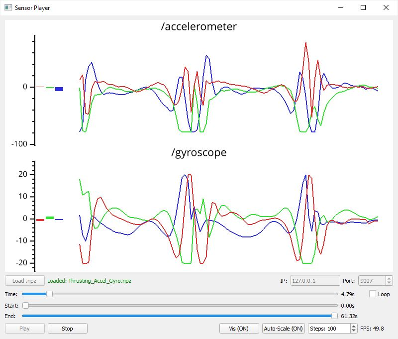

## AI-Toolbox - Motion Utilities - Sensor Player



Figure 1: The figure shows a screenshot of the SensorPlayer software plays back a recording containing gyroscope and acceleration data from an IMU sensor.

### Summary

SensorPlayer is Python-based software for playing motion-data streams recorded as NPZ files. These recordings are created using the [SensorRecorder](https://github.com/bisnad/MotionUtilities/tree/main/SensorRecorder_v2) tool. The motion data can optionally be visualized as time-series plots. During playback, the tool sends the current motion-data values as OSC messages to a target address and port. These OSC messages are identical to those originally received by the [SensorRecorder](https://github.com/bisnad/MotionUtilities/tree/main/SensorRecorder_v2) tool when creating the recordings. 

### Installation

The software runs within the *premiere* anaconda environment. For this reason, this environment has to be setup beforehand.  Instructions how to setup the *premiere* environment are available as part of the [installation documentation ](https://github.com/bisnad/AIToolbox/tree/main/Installers) in the [AI Toolbox github repository](https://github.com/bisnad/AIToolbox). 

The software can be downloaded by cloning the [MotionUtilities Github repository](https://github.com/bisnad/MotionUtilities). After cloning, the software is located in the MotionUtilities / MocapRecorder directory.

### Directory Structure

- SensorPlayer (contains software specific python scripts)
  - data 
    - media (contains media used in this Readme)
  - recordings (contains some example recordings)

### Usage

#### Start

The software can be started either by double clicking the sensor_player.bat (Windows) or sensor_player.sh (MacOS) shell scripts or by typing the following commands into the Anaconda terminal:

```
conda activate premiere
cd SensorPlayer
python sensor_player.py
```

#### Functionality

The software can load and playback motion recordings in NPZ format. These recordings have been created using the [SensorRecorder](https://github.com/bisnad/MotionUtilities/tree/main/SensorRecorder_v2) tool. receive and store any sensor values transmitted via OSC. During playback, the tool sends the current motion-data values as OSC messages to a target address and port. These OSC messages are identical to those originally received by the [SensorRecorder](https://github.com/bisnad/MotionUtilities/tree/main/SensorRecorder_v2) tool when creating the recordings. 

Optionally, stored sensor values can be visualized as bar and time-series plots. Because visualization is computationally demanding, it should be used only to verify that sensor data is correct and otherwise disabled during playback.

#### Graphical User Interface

The software’s graphical user interface provides the following functionality and information, listed from top to bottom and left to right:

- A graphical window that can optionally display motion data as bar charts and time-series plots.
- A button for loading a motion recording in NPZ format.
- A text input field for specifying the IP address to which motion data is sent as OSC messages.
- A numeric input field for specifying the port to which motion data is sent as OSC messages.
- A slider for setting the current playback position in seconds.
- A toggle for enabling or disabling playback looping.
- A slider for setting the start of the playback range in seconds.
- A slider for setting the end of the playback range in seconds.
- Two buttons for starting and stopping motion-data playback.
- Two buttons for enabling or disabling time-series visualization and for enabling or disabling autoscaling of the motion-data value range, for visualization purposes only.
- An integer input field for specifying the length of the displayed time series, expressed as a number of steps.
- A text display indicating the frame rate at which the time-series visualization is running.

### OSC Communication

The software sends sensor values as OSC messages. The messages have the following format:.

`message_address <float value1> <float value2> .... <float valueD>` 

In this message description, D represents the dimension of the sensor values. 

### Limitations and Bugs

The software cannot yet be remote controlled via OSC.
