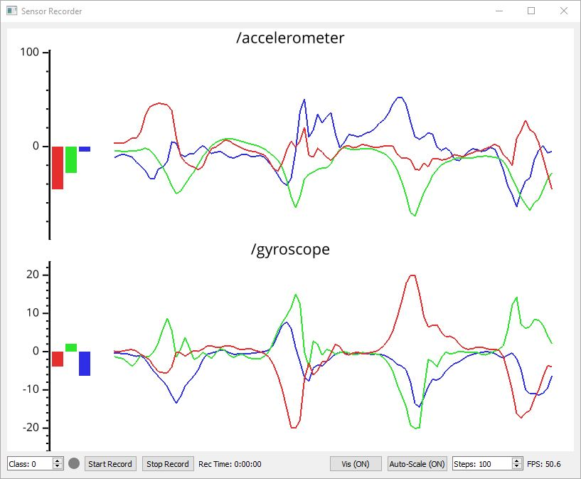

## AI-Toolbox - Motion Utilities - Sensor Recorder



Figure 1: The figure shows a screenshot of the SensorRecorder software that is receiving gyroscope and acceleration data from an IMU sensor.

### Summary

The SensorRecorder is a Python-based software for recording motion data streams that it receives motion data via [OSC](https://en.wikipedia.org/wiki/Open_Sound_Control). Motion data can come from any source such as a full body motion capture system or individual wearable sensors. The motion data can be optionally visualised as time-series plots. Each recording can be associated with a class label if it is to be used to train a motion classifier such as the [MocapClassifier](https://github.com/bisnad/MotionAnalysis/tree/main/MocapClassifier) included among the [MotionAnalysis](https://github.com/bisnad/MotionAnalysis) tools of the [AI-Toolbox](https://github.com/bisnad/AIToolbox).  The class labels and sensor values are stored as NPZ files. 

### Installation

The software runs within the *premiere* anaconda environment. For this reason, this environment has to be setup beforehand.  Instructions how to setup the *premiere* environment are available as part of the [installation documentation ](https://github.com/bisnad/AIToolbox/tree/main/Installers) in the [AI Toolbox github repository](https://github.com/bisnad/AIToolbox). 

The software can be downloaded by cloning the [MotionUtilities Github repository](https://github.com/bisnad/MotionUtilities). After cloning, the software is located in the MotionUtilities / MocapRecorder directory.

### Directory Structure

- SensorRecorder (contains software specific python scripts)
  - data 
    - media (contains media used in this Readme)
  - recordings (location where recordings are stored)

### Usage

#### Start

The software can be started either by double clicking the sensor_recorder.bat (Windows) or sensor_recorder.sh (MacOS) shell scripts or by typing the following commands into the Anaconda terminal:

```
conda activate premiere
cd SensorRecorder
python sensor_recorder.py
```

#### Functionality

The software can receive and store any sensor values transmitted via OSC. For each unique OSC message address, two lists are created: the first contains all values received for that address, in the order in which the messages were received; the second contains the corresponding timestamps. These lists, together with their associated OSC message addresses, are exported as a NumPy dictionary in NPZ format. Recording file names are generated automatically using the following format: Sensor_class<class_id>time<time_stamp>.npz.

Optionally, received sensor values can be visualized as bar and time-series plots. Because visualization is computationally demanding, it should be used only to verify that sensor data is being received and otherwise disabled during recording.

#### Graphical User Interface

The software’s graphical user interface provides the following functionality and information, listed from top to bottom and left to right:

- A graphical window that can optionally display incoming sensor data as bar and time series plots. The bar plots display the instantaneous sensor values and the time series display a history of the most recent sensor values. 
- A numeric input field for assigning a class label to the sensor data.
- A circle that is red while recording is in progress and gray otherwise.
- Two buttons for starting and stopping sensor-data recording. The Start button automatically begins a new recording, while the Stop button automatically saves the preceding recording.
- A text display indicating the current recording time.
- Two buttons for enabling or disabling time-series visualization and for enabling or disabling autoscaling of the sensor-value range, for visualization purposes only.
- An integer input field for specifying the length of the displayed time series, expressed as a number of steps.
- A text display indicating the frame rate at which the time-series visualization is running.

### OSC Communication

The software receives sensor values as OSC messages. The messages must have the following format:.

`message_address <float value1> <float value2> .... <float valueD>` 

In this message description, D represents the dimension of the sensor values. 

By default, the software receives OSC messages on port 9004. To change this port, the following source code in the file mocap_recorder.py has to be modified:

```
osc_receive_port = 9007
```

In this code, the number 9007 needs to be replaced to specify a different port.

### Limitations and Bugs

The software cannot yet be remote controlled via OSC.
