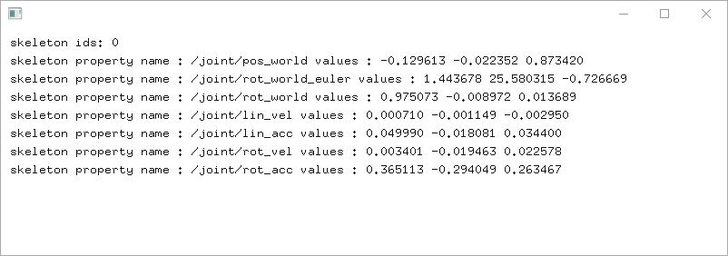
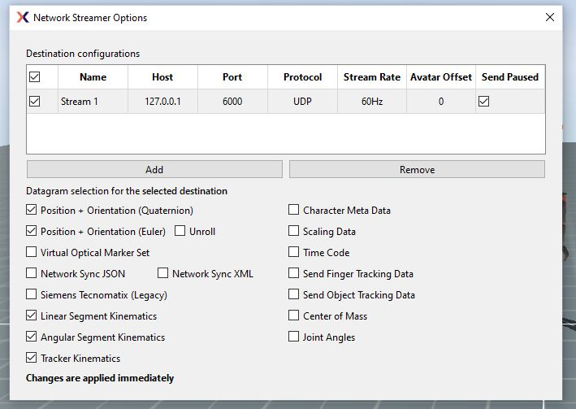

## AI-Toolbox - Motion Utilities - XSens2Osc

Figure 1: The figure shows a screenshot of the XSens2Osc software.

### Summary

XSens2Osc is a small C++-based software that receives motion capture data from the [XSens MVN](https://www.movella.com/products/motion-capture/mvn-analyze) Software and forwards this data as [OSC](https://en.wikipedia.org/wiki/Open_Sound_Control) messages. 

### Installation

For simply executing the software, no installation is required. The software runs on any Windows 10 or 11 operating system. If the user wants to compile the software from source, both a C++ IDE such as [Visual Studio](https://visualstudio.microsoft.com/vs/community/) and the [openFrameworks](https://openframeworks.cc/) creative coding environment need to be installed beforehand. Installation instructions for Visual Studio and openFrameworks are available in the [AI Toolbox github repository](https://github.com/bisnad/AIToolbox). 

The software can be downloaded by cloning the [MotionUtilities Github repository](https://github.com/bisnad/MotionUtilities). After cloning, the software is located in the MotionUtilities / XSens2Osc directory.

### Directory Structure

- XSens2Osc (contains theVisual Studio project file)

  - data 
    - media (contains media used in this Readme)

  - bin (contains the software  executable and dynamic libraries)
    - data (contains a configuration file that specifies several software settings)
  - src (contains the source code files)

### Usage

#### Start

The software can be started by double clicking the xsens2osc.exe file.

#### Functionality

The software receives the mocap data that it receives through network streaming from the XSens MVN software and forwards this data via OSC. The software supports for an arbitrary number of performers the following type of mocap data: 3D joint positions, joint rotations as Euler angles, joint rotations as quaternions, linear and angular joint velocities and accelerations, and raw inertial sensor data. In order for the software to forward this data, the network streamer options in the MVN   software have to be set accordingly. Figure 2 depicts a screenshot of the network streaming options in the MVN software will all mocap data types supported by the XSens2Osc software selected. To avoid overloading XSens2Osc with data, it can be helpful to limit the stream rate to a Maximum of 60Hz. The stream rate can also be set in the network streamer options in the MVN   software. 

Figure 2: The figure shows a screenshot of the Network Streamer Options Window in the XSens MVN software (Analyze Pro 2023).

#### Graphical User Interface

The software possesses a minimal graphical user interface that displays the outgoing OSC messages. For each OSC message, the message address and the first three values are shown. 

### OSC Communication

The software sends only OSC messages for those mocap data that has been selected for sending in the XSens MVN Network Streamer Options window. If the 

The software sends the following OSC messages representing the joint positions and rotations of the currently displayed motion capture figure.
Each message contains all the joint positions and rotations grouped together. In the OSC messages described below, N represents the number of joints.

The following OSC messages are sent by the software:

- joint positions as list of 3D vectors relative to parent joint: `/mocap/0/joint/pos_local <float j1x> <float j1y> <float j1z> .... <float jNx> <float jNy> <float jNz>` 
- joint positions as list of 3D vectors in world coordinates: `/mocap/0/joint/pos_world <float j1x> <float j1y> <float j1z> .... <float jNx> <float jNy> <float jNz>` 
- joint rotations as list of Quaternions relative to parent joint: `/mocap/0/joint/rot_local <float j1w> <float j1x> <float j1y> <float j1z> .... <float jNw> <float jNx> <float jNy> <float jNz>` 
- joint rotations as list of Quaternions in world coordinates: `/mocap/0/joint/rot_local <float j1w> <float j1x> <float j1y> <float j1z> .... <float jNw> <float jNx> <float jNy> <float jNz>` 

### Limitations

XSens2Osc doesn't provide a GUI for changing the network address and port address for sending OSC messages to. These settings need to be changed by editing the "config.json" file in the bin/data/ Folder.

Max Speed issues

### Dependencies

To compile the XSens2Osc tool from source, one additional Addon that is not part of the openFrameworks default distribution need to be present in the addons directory of openFrameworks. This addon can be downloaded from its own dedicated online repository:

- [ofxDabBase](https://github.com/bisnad/ofxDabBase) 

  ofxDabBase provides some basic functionality in the form of classes that deal with multidimensional data, text file parsing, and information flow. 

### OSC Communication

XSens2Osc adds the identifier for the tracked performer as "skelID" to the address part of the OSC message.
Xens2Osc groups joint motion capture data together as follows:  j1_p1 j1_p2 ... j1_pD, j2_p1, j2_p2, ... j2_pD, ... , jN_p1, jN_p2, ... jN_pD- Here, j stands for joint, p for parameter, N for number of joints, and D for dimension of parameters.
XSens2Osc groups raw sensor motion capture data together as follows:  s1_p1 s1_p2 ... s1_pD, s2_p1, s2_p2, ... s2_pD, ... , sN_p1, sN_p2, ... sN_pD- Here, s stands for sensor, p for parameter, N for number of sensors , and D for dimension of parameters.

joint positions as list of 3D vectors in world coordinates: `/skel/skelID/joint/pos_world <float j1x> <float j1y> <float j1z> .... <float jNx> <float jNy> <float jNz>` 

joint rotations as list of Euler angles in world coordinates: `/skel/skelID/joint/rot_world_euler <float j1x> <float j1y> <float j1z> .... <float jNx> <float jNy> <float jNz>` 

joint rotations as list of quaternions in world coordinates: `/skel/skelID/joint/rot_world_euler <float j1w> <float j1x> <float j1y> <float j1z> .... <float jNw> <float jNx> <float jNy> <float jNz>`

joint linear velocities as list of 3D vectors in world coordinates: `/skel/skelID/joint/lin_vel <float j1x> <float j1y> <float j1z> .... <float jNx> <float jNy> <float jNz>` 

joint linear accelerations as list of 3D vectors in world coordinates: `/skel/skelID/joint/lin_acc <float j1x> <float j1y> <float j1z> .... <float jNx> <float jNy> <float jNz>` 

joint angular velocities as list of Euler angles in world coordinates: `/skel/skelID/joint/rot_vel <float j1x> <float j1y> <float j1z> .... <float jNx> <float jNy> <float jNz>` 

tracking sensor identifiers as list of integers: `/skel/skelID/tracker/id <int s1> <int s2> .... <int sN>`  

tracking sensor rotations as list of quaternions in world coordinates: `/skel/skelID/tracker/rot_world <float s1w> <float s1x> <float s1y> <float s1z> .... <float sNw> <float sNx> <float sNy> <float sNz>` 

tracking sensor accelerations as list of Euler angles in world coordinates: `/skel/skelID/tracker/accel_world <float s1x> <float s1y> <float s1z> .... <float sNx> <float sNy> <float sNz>` 

tracking sensor accelerations as list of Euler angles in relative coordinates: `/skel/skelID/tracker/accel <float s1x> <float s1y> <float s1z> .... <float sNx> <float sNy> <float sNz>` 

tracking sensor angular velocities as list of Euler angles in relative coordinates: `/skel/skelID/tracker/angular_vel <float s1x> <float s1y> <float s1z> .... <float sNx> <float sNy> <float sNz>` 

